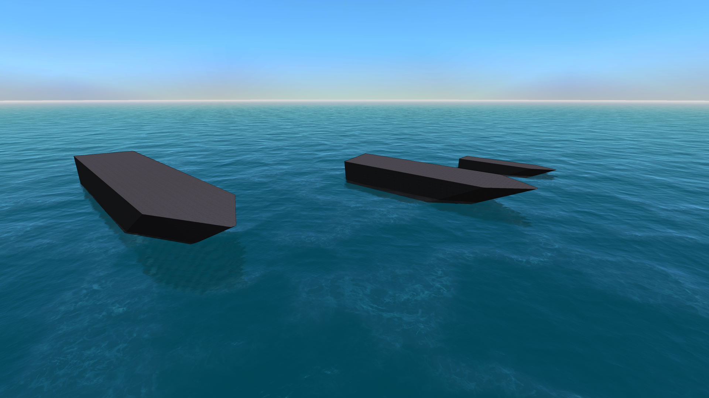

Fasthull
========

Produces a simple procedural boat hull with the desired dimensions,
including color-layered armor.



Prerequisites
-------------
* Python 3.10+ (not tested on older Python 3.x versions)
* A "donor" blueprint to copy an author tag from

Usage
-----
```
usage: generate.py [-h]
                   donor_blueprint output_blueprint width height length
                   {1,2,3,4} side_armor deck_armor bottom_armor

Generates a simple boat hull, copying the author tag from a donor blueprint.

positional arguments:
  donor_blueprint   The donor blueprint from which to copy the author tag.
  output_blueprint  The output file name for the blueprint to produce.
  width             The width of the main cuboid.
  height            The height of the main cuboid.
  length            The length of the main cuboid.
  {1,2,3,4}         Slope of front (1-4)
  side_armor        Number of _additional_ side armor layers.
  deck_armor        Number of _additional_ deck armor layers.
  bottom_armor      Number of _additional_ bottom armor layers.

options:
  -h, --help        show this help message and exit

```

Example usage
-------------

```
python3 generate.py path/to/donor.blueprint path/to/target.blueprint 11 7 60 2 3 1 1
```
produces a hull with following properties:

* minimum interior cuboid 11x7x60
* front slope 2
* 3 additional side armor layers
* 1 additional deck armor layer
* 1 additional ventral armor layer

Additional armor layers are colored by layer and can be replaced with armor
refit tool or script.

License
-------
Apache 2.0 (see LICENSE, or explainer [here](https://choosealicense.com/licenses/apache-2.0/)).