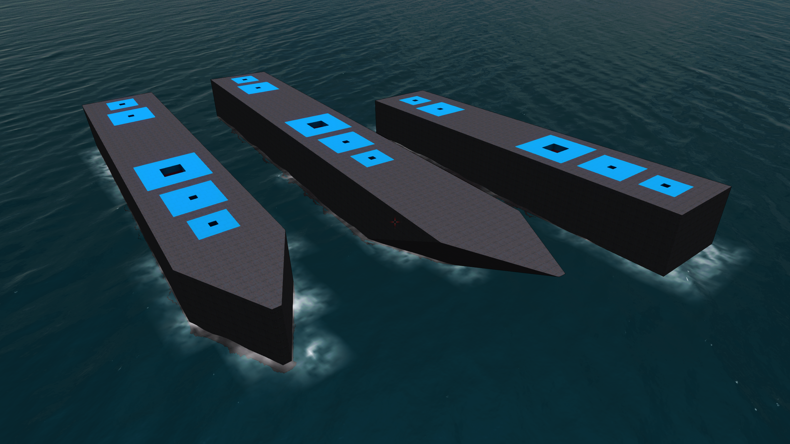

Fasthull
========

Produces a simple procedural boat hull with the desired dimensions,
including color-layered armor.



Prerequisites
-------------
* Python 3.10+ (not tested on older Python 3.x versions)
* A "donor" blueprint to copy an author tag from

Usage
-----
```
usage: generate.py [-h]
                   [--bow-type {rake|plumb|blunt}]
                   [--tws n] [--tw n] [--tws n] [--tw n] [...]
                   donor_blueprint output_blueprint width height length
                   {1,2,3,4} side_armor deck_armor bottom_armor

Generates a simple boat hull, copying the author tag from a donor blueprint.

positional arguments:
  donor_blueprint   The donor blueprint from which to copy the author tag.
  output_blueprint  The output file name for the blueprint to produce.
  width             The width of the main cuboid.
  height            The height of the main cuboid.
  length            The length of the main cuboid.
  {1,2,3,4}         Slope of front (1-4)
  side_armor        Number of _additional_ side armor layers.
  deck_armor        Number of _additional_ deck armor layers.
  bottom_armor      Number of _additional_ bottom armor layers.

options:
  -h, --help        show a help message
  --bow-type        generate this type of bow
  --tws             add this many blocks of space before the next turret well
  --tw              add a turret well with this interior radius

```

Example usage
-------------

```
python3 generate.py path/to/donor.blueprint path/to/target.blueprint 11 7 60 2 3 1 1
```
produces a hull with following properties:

* minimum interior cuboid 11x7x60
* front slope 2
* 3 additional side armor layers
* 1 additional deck armor layer
* 1 additional ventral armor layer

Additional armor layers are colored by layer and can be replaced with armor
refit tool or script.

Bow shapes
----------
* rake: slopes upward from the keel and inward from the sides
* plumb: slopes inward from the sides only, vertical forward edge
* blunt: flat forward surface

Turret wells
------------
To automatically bore turret wells:

* Add a `--tws` to specify the spacing between the front of the main
cuboid and the first turret well. You must specify this even if 0.
* Add a `--tw` to specify the first turret well's interior radius.
* The generator will create a square well of the specified radius and
encase with 1 layer blocks color 31 between the deck level and the
ventral level. It will also replace the topmost deck armor with a layer
of blocks color 29, leaving a hole of radius 1 or 2 (depending on
radius) through which to send interior turret structure.
* Add another `--tws` to specify the spacing to next turret well.
* Add another `--tw` to specify the second turret well's interior
radius.
* etc.

Tool does not elevate turret wells automatically (you must do this
yourself). Turret wells that would extend beyond the main cuboid will not be
placed.

```
python3 generate.py path/to/donor.blueprint path/to/target.blueprint 11 7 60 2 3 1 1 --tws 5 --tw 3 --tws 3 --tw 3
```
adds a couple of turret wells to the first example, with additional spacing
before the first well.

License
-------
Apache 2.0 (see LICENSE, or explainer [here](https://choosealicense.com/licenses/apache-2.0/)).